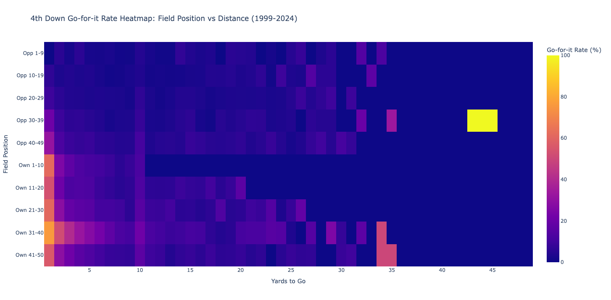

# NFL 4th Down Decision Analysis

## Executive Summary

There are few moments in football more tense than a 4th down attempt. Once seen as the universal sign of a desperate football team, the 4th down attempt is now one of the clearest signals of how much the game has changed. In this project, I dug into **108,866 NFL 4th down situations** from 1999–2024 to see how strategy has shifted over the years, especially as the analytics movement has pushed teams to take more risks.

What started as a raw data dive turned into a storytelling project: 19 interactive visualizations that track when teams punt, kick, or go for it — and how those choices play out by distance, field position, game situation, and era. The goal wasn’t just to crunch numbers, but to uncover the “why” behind coaching decisions, and highlight where modern football is still conservative compared to the math.

## Key Business Insights

### The Analytics Revolution is Real

Teams have become significantly more aggressive on 4th downs since 2015, particularly in midfield situations, reflecting the influence of advanced analytics on NFL decision-making.

### Distance is King

The 1-yard situation has a **66.3% success rate**, making it almost always a go-for-it scenario, while success rates drop dramatically with distance.


_Success rates drop dramatically with distance, with 1-yard situations having 66.3% success rate_

### Run vs Pass Paradox

While run plays are more successful overall (**64.2% vs 41.4%**), teams still pass more often (61.9% vs 38.1%), suggesting potential optimization opportunities.

### Time Creates Desperation

Teams are **5x more likely** to go for it in the final 5 minutes compared to the first half, showing how game situation drives decision-making.

### Field Position Matters

Teams are most aggressive in their own territory but most successful in midfield, indicating risk tolerance varies by field position.

### QB Sneaks are Underutilized

With a **68.9% success rate**, QB sneaks are highly effective but only used in 31.8% of short-yardage situations.

## Dataset Overview

- **Total 4th Down Situations**: 108,866 across 26 seasons (1999-2024)
- **Go-for-it Attempts**: 14,584 (13.4% of all 4th downs)
- **Overall Success Rate**: 50.1% (7,306 successful conversions)
- **Kick Attempts**: 94,282 (86.6% of all 4th downs)

## Detailed Analysis Findings

### Success Rate Analysis by Distance

The data reveals a clear inverse relationship between distance and success:

| Distance  | Success Rate  | Attempts | Key Insight              |
| --------- | ------------- | -------- | ------------------------ |
| 1 yard    | 66.3%         | 5,532    | Clear go-for-it scenario |
| 2 yards   | 53.8%         | 1,770    | Strong go-for-it case    |
| 3 yards   | 48.6%         | 1,211    | Marginal go-for-it       |
| 4 yards   | 46.1%         | 1,016    | Close decision           |
| 5 yards   | 42.3%         | 893      | Depends on situation     |
| 10+ yards | ~30% or lower | Variable | Generally kick           |

### Run vs Pass Strategy Analysis

**Play Distribution:**

- **Pass plays**: 9,033 attempts (61.9%)
- **Run plays**: 5,551 attempts (38.1%)

**Success Rates:**

- **Run plays**: 64.2% success rate
- **Pass plays**: 41.4% success rate

**Distance-Based Strategy:**

- **Short yardage (1-3 yards)**: Run plays significantly outperform pass plays
  - 1 yard: Run 70.0% vs Pass 54.9%
  - 2 yards: Run 59.2% vs Pass 51.7%
  - 3 yards: Run 58.3% vs Pass 46.9%
- **Medium yardage (4-6 yards)**: Run plays still have slight advantage
- **Long yardage (7+ yards)**: Pass plays become more effective

### Time-Based Aggression Patterns

Teams become significantly more aggressive as the game progresses:

| Game Situation | Go-for-it Rate | Multiplier vs 1st Half |
| -------------- | -------------- | ---------------------- |
| 1st Half       | 7.1%           | 1.0x (baseline)        |
| 3rd Quarter    | 9.0%           | 1.3x                   |
| Early 4th Q    | 9.4%           | 1.3x                   |
| Late 4th Q     | 16.3%          | 2.3x                   |
| Final 5 Min    | 37.3%          | 5.3x                   |

### Field Position Analysis

**Go-for-it rates by field position:**

- **Own 31-40**: 29.5% (highest aggression)
- **Own 1-10**: 25.5%
- **Own 21-30**: 19.1%
- **Own 41-50**: 18.0%
- **Own 11-20**: 15.4%
- **Opponent territory**: 2.8-10.1% (much more conservative)


_Teams are most aggressive in their own territory but most successful in midfield, showing clear field position decision patterns_

**Success rates by field position:**

- **Opponent 30-39**: 52.1% (highest success)
- **Own 41-50**: 52.9%
- **Opponent 40-49**: 50.2%
- **Red zone (Opp 1-19)**: 20.3-32.0% (lowest success)

### Yearly Trends - The Analytics Revolution

**Success Rate Evolution:**

- **1999-2010**: Relatively stable around 45-50%
- **2011-2017**: Some fluctuation, generally 47-52%
- **2018-2024**: Notable improvement, reaching **57.1% in 2024**


_Teams have become significantly more aggressive on 4th downs since 2015, reflecting the analytics revolution_

**Strategy Evolution:**

- **Early years (1999-2005)**: ~60% pass, ~40% run
- **Analytics era (2015-2024)**: Shift toward more passing (65-70% pass)
- **2020-2024**: Slight return to more balanced approach (~60% pass)

**Field Position Aggression Trends:**

- **Midfield (Own 41-50)**: Dramatic increase from 14.6% (1999) to **28.6% (2024)**
- **Opponent 40-49**: Increase from 6.8% (1999) to **18.0% (2024)**
- **Red zone**: Remains conservative (2-6% go-for-it rate)

### QB Sneak Analysis

**Usage Patterns:**

- **Total QB sneaks**: 4,641 (31.8% of all go-for-it attempts)
- **Success rate**: 68.9% (significantly higher than non-sneak 41.3%)
- **Distance breakdown**:
  - 1 yard: 70.0% success rate (4,146 attempts)
  - 2 yards: 59.2% success rate (495 attempts)

**Yearly Trends:**

- **Usage**: Relatively stable 28-37% of go-for-it attempts
- **Success rate**: Improved from ~66% (1999-2000) to **~75% (2023-2024)**
- **Peak usage**: 2020 (36.7%) and 2024 (35.4%)

## Strategic Recommendations

### For NFL Teams

1. **Increase 4th and 1 attempts**: The 66.3% success rate makes this a clear go-for-it scenario
2. **Optimize run/pass balance**: Consider more run plays in short-yardage situations
3. **Midfield aggression**: The data supports being more aggressive in midfield situations
4. **QB sneak utilization**: Increase QB sneak usage in 1-2 yard situations
5. **Time-based strategy**: Develop different approaches for different game situations

### For Data Science Applications

- **Complex data manipulation**: 108,866+ records across 26 seasons
- **Multi-dimensional analysis**: Field position, time, distance, and strategy analysis
- **Time series analysis**: Trend identification over 25+ years
- **Business insight generation**: Converting data into actionable recommendations

## Data Sources

### Primary Dataset

This analysis uses NFL play-by-play data from the [nflverse-data repository](https://github.com/nflverse/nflverse-data/releases/tag/pbp), which provides comprehensive play-by-play data for all NFL games from 1999-2024.

**Access Method:**

```r
# Using nflreadr package (recommended)
library(nflreadr)
pbp_data <- load_pbp(1999:2024)
```

**Alternative Access:**

- Direct download from [nflverse-data releases](https://github.com/nflverse/nflverse-data/releases/tag/pbp)
- Files: `play_by_play_YYYY.parquet` for years 1999-2024

**Dataset Details:**

- **Source**: nflverse community (open source NFL data initiative)
- **Coverage**: 108,866+ 4th down situations across 26 seasons
- **Format**: Parquet files with comprehensive play-by-play data
- **Update Frequency**: Regular updates during NFL season
- **License**: Open source, freely available for analysis

### Data Attribution

This project follows data science best practices by:

- Citing the original data source
- Providing clear access instructions
- Acknowledging the nflverse community's contribution to NFL analytics
- Using reproducible data access methods

## Technical Implementation

### Analysis Techniques

- Time series analysis for trend identification
- Multi-dimensional heatmap analysis
- Success rate calculations with statistical significance
- QB sneak identification using player name matching

### Key Metrics

- **Go-for-it Rate**: Percentage of 4th downs where teams attempt to convert
- **Success Rate**: Percentage of go-for-it attempts that result in first downs
- **Field Position Categories**: 10 zones from own goal line to opponent goal line
- **Time Categories**: 5 game situation buckets from first half to final 5 minutes

## Interactive Visualizations

The analysis generates **19 interactive visualizations** covering:

### Core Analysis Charts

- Overall Go vs Kick Decisions
- Yearly Decision Trends
- Success Rates by Distance

### Strategic Analysis

- Run vs Pass Strategy Comparison
- Run vs Pass by Distance Analysis
- Time-Based Aggression Patterns
- Field Position Decision Making
- Field Position Success Analysis

### Advanced Heatmaps

- Field Position vs Distance Heatmap
- Field Position vs Distance Success Heatmap
- Time vs Field Position Heatmap
- Yearly Field Position Evolution

### Trend Analysis

- Success Rate Trends by Year
- Strategy Evolution Trends
- Time-Based Strategy Trends
- Yearly Field Position Trends

### QB Sneak Analysis

- QB Sneak Usage Trends
- QB Sneak Success Rate Trends
- QB Sneak Success by Distance

## Project Structure

```
nfl-4th-down-analysis/
├── fourth_down_scripts.py          # Main analysis script
├── create_dashboard.py             # Dashboard generator
├── create_presentation.py          # Presentation generator
├── pbp_data/                       # NFL play-by-play data (1999-2024)
├── charts/                         # Interactive HTML visualizations
├── chart_images/                   # Static chart images
├── NFL_4th_Down_Analysis_Dashboard.html
├── NFL_Analysis_Presentation.html
└── README.md                       # This file
```

## Getting Started

1. **Install Dependencies**

   ```bash
   pip install pandas plotly
   ```

2. **Run Analysis**

   ```bash
   python fourth_down_scripts.py
   ```

3. **Generate Dashboard and Presentation**

   ```bash
   python create_dashboard.py
   python create_presentation.py
   ```

4. **View Results**
   - Open `NFL_4th_Down_Analysis_Dashboard.html` for comprehensive analysis
   - Open `NFL_Analysis_Presentation.html` for executive summary
   - Explore interactive charts in the `charts/` directory

## Technical Stack

- **Python** with Pandas for data manipulation
- **Plotly** for interactive visualizations
- **Statistical Analysis** for trend identification
- **Data Cleaning** and validation
- **Multi-dimensional Analysis** with heatmaps

## Portfolio Value

This project demonstrates:

- **Data Analysis Skills**: Complex data manipulation and cleaning of 108,866+ records
- **Statistical Analysis**: Trend identification and success rate calculations
- **Visualization**: 19 interactive charts and heatmaps
- **Business Insight**: Actionable recommendations for NFL teams
- **Technical Proficiency**: Python, Pandas, Plotly, and data science best practices
- **Time Series Analysis**: 25+ years of trend analysis
- **Multi-dimensional Analysis**: Field position, time, distance, and strategy analysis

## Business Applications

### For NFL Teams

- Optimize 4th down decision-making based on field position and game situation
- Identify successful strategies for different scenarios
- Track league-wide trends to stay competitive

### For Sports Analytics

- Demonstrate advanced data analysis capabilities
- Show ability to extract actionable insights from complex datasets
- Illustrate trend analysis and predictive modeling skills

### For Data Science Roles

- Complex data manipulation and cleaning
- Multi-dimensional analysis and visualization
- Time series analysis and trend identification
- Business insight generation from data

---

_This analysis demonstrates proficiency in data analysis, visualization, and business insight generation. All visualizations are interactive and can be explored in detail to understand the comprehensive patterns in NFL 4th down decision-making over the past 25+ years._
